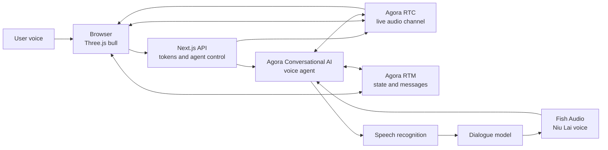

<div align="center">

# Niu Lai AI

**A 3D bull that hears you, answers you, and makes faces.**

Let a 3D bull hear you, answer you, and turn live voice into mouth, brow, gaze,
and expression-driven animation.

[](https://niulai-ai.vercel.app/)
[](./LICENSE)
[](https://www.agora.io/)
[](https://www.agora.io/en/products/conversational-ai/)
[](https://threejs.org/)

[简体中文](./README.md) · **English**

</div>

---

Live demo: [niulai-ai.vercel.app](https://niulai-ai.vercel.app/)

## Technical Implementation

Niu Lai is not a page that plays back a prerecorded conversation. It combines a
browser-side 3D scene, a real-time audio channel, and a voice agent:

- Three.js handles the model, materials, camera, and interaction.
- Agora RTC carries two-way live audio between the browser and the voice agent.
- Agora Conversational AI Agent joins the channel, understands the caller,
  generates a response, and publishes speech back into the call.
- Agora RTM synchronizes agent state and real-time messages during the session.
- The browser subscribes to agent audio and feeds live volume levels into the 3D
  character animation.

This is a small but complete loop: from a browser microphone, through a
real-time channel, and back to a 3D character with a face.

## Architecture



## Quick Start

### 1. Install

```bash
pnpm install
```

### 2. Configure environment variables

Create `.env.local` in the project root:

```dotenv
NEXT_PUBLIC_AGORA_APP_ID=
NEXT_AGORA_APP_CERTIFICATE=
NEXT_PUBLIC_AGENT_UID=123456
FISH_AUDIO_API_KEY=
CALL_TICKET_SECRET=
FISH_AUDIO_NIULAI_REFERENCE_ID=
```

Keep Agora project credentials and Fish Audio secrets in local or deployment
server-side environment variables. Do not commit them to Git.

### 3. Run

```bash
pnpm dev
```

Open [http://localhost:3000](http://localhost:3000).

## License

The source code is released under the [MIT License](./LICENSE).

The character, 3D model, voice, and other assets may be subject to separate
copyright, trademark, or license terms. The MIT License does not automatically
cover third-party assets; verify the relevant rights before reuse.
