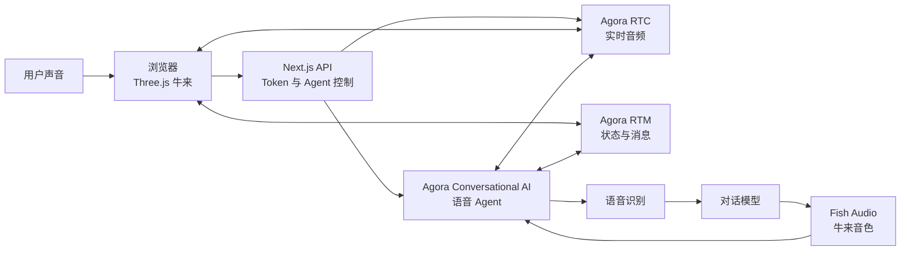

<div align="center">

# 牛来 AI

[](https://niulai-ai.vercel.app/)
[](./LICENSE)
[](https://www.agora.io/)
[](https://www.agora.io/en/products/conversational-ai/)
[](https://threejs.org/)

**简体中文** · [English](./README.en.md)

</div>

---

在线体验：[niulai-ai.vercel.app](https://niulai-ai.vercel.app/)

## 技术实现

牛来 AI 由浏览器端 3D 场景、实时音频通道和语音 Agent 组成：

- **Three.js**：模型、材质、镜头、拖动和角色动画。
- **Agora RTC**：承载浏览器与语音 Agent 之间的双向实时音频。
- **Agora Conversational AI**：让语音 Agent 加入频道、理解用户语音、生成回答并发布语音。
- **Agora RTM**：同步 Agent 状态和对话过程中的实时消息。
- **Fish Audio**：提供默认的牛来声音，也可以替换成自己的服务端音色配置。



## Quick Start

### 1. 安装依赖

```bash
pnpm install
```

### 2. 配置环境变量

在项目根目录创建 `.env.local`：

```dotenv
NEXT_PUBLIC_AGORA_APP_ID=
NEXT_AGORA_APP_CERTIFICATE=
NEXT_PUBLIC_AGENT_UID=123456
FISH_AUDIO_API_KEY=
CALL_TICKET_SECRET=
FISH_AUDIO_NIULAI_REFERENCE_ID=
```

凭据和密钥只放在本地或部署平台的服务端环境变量中，不要提交到 Git。

### 3. 启动

```bash
pnpm dev
```

打开 [http://localhost:3000](http://localhost:3000)。

## License

项目源代码采用 [MIT License](./LICENSE)。

角色、3D 模型、声音和其他素材可能受到单独的版权、商标或授权条款约束；MIT 许可不自动覆盖不属于本项目原创的第三方素材。二次使用前请分别确认相关权利。
